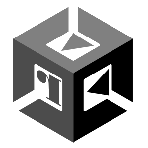

# r2unity

[](https://github.com/radareorg/r2unity/actions/workflows/ci.yml)



`r2unity` is a command-line tool and radare2 plugin set for inspecting Unity
IL2CPP builds. It parses `global-metadata.dat`, correlates it with the native
IL2CPP binary, and exposes managed metadata for reverse engineering.

## Highlights

- Parses IL2CPP metadata wire versions v24.1+ through v35, plus v38/v39
  metadata used by recent Unity 6 builds.
- Detects companion files for iOS, Android extracted APKs, macOS, Windows,
  Linux, and flat fixture layouts.
- Recovers managed images, assemblies, types, methods, method flags, and `ldstr`
  string literals.
- Resolves method pointers through r_bin symbols/CodeRegistration, with
  r_bin or simple ELF/Mach-O/PE section-scan fallback for stripped binaries.
- Lists P/Invoke and v29+ reverse-P/Invoke metadata, and emits CycloneDX 1.5
  SBOMs for managed assemblies.
- Provides both a core r2 command plugin and an `r_bin` plugin for direct
  `global-metadata.dat` inspection.
- Parses IL2CPP `*.dll-resources.dat` packs and exposes named payloads through
  radare2's resource listing and extraction APIs.
- Recognizes Unity SerializedFile v22 asset databases and exposes their
  headers, object ranges, names, symbols, classes, dependencies, and resources.
- Resolves bounded `Texture2D`/`Mesh` `.resS` and `AudioClip`/`VideoClip`
  `.resource` ranges beside loose SerializedFiles for `iU`/`iUx` extraction.
- Recognizes BGDatabase v6 repositories and whole-database saves, including
  addon payloads, table regions, fields, symbols, and validated UTF-8 values.

## Build

`r2unity` requires radare2 development files available through `pkg-config`.

```sh
make
make plugin
make user-install
```

Or with Meson:

```sh
meson setup build
meson compile -C build
meson install -C build
```

Most users can install it through r2pm:

```sh
r2pm -ci r2unity
```

`make` builds the CLI. `make plugin` builds `core_r2unity` and `bin_r2unity`.
`make user-install` installs the CLI and plugins for the current user.
Meson builds the CLI by default, matching `make`. Use `-Dplugins=enabled` to
build the radare2 plugins too, or `-Dr2_plugindir=/path/to/plugins` to override
the plugin install directory.

## CLI

The normal inputs are the native IL2CPP binary and the matching
`global-metadata.dat`.

```sh
# detect companion files and platform
./r2unity -D /path/to/unity-build

# compact metadata summary
./r2unity -j /path/to/GameAssembly.dll /path/to/global-metadata.dat

# recover method flags/comments as r2 commands
./r2unity -f /path/to/GameAssembly.dll /path/to/global-metadata.dat > methods.r2

# override a known native registration symbol address
./r2unity -f -O g_CodeRegistration=0x1234 /path/to/GameAssembly.dll /path/to/global-metadata.dat

# list managed strings, interop metadata, or managed-assembly SBOM data
./r2unity -z /path/to/global-metadata.dat
./r2unity -P -j /path/to/GameAssembly.dll /path/to/global-metadata.dat
./r2unity -R -j /path/to/GameAssembly.dll /path/to/global-metadata.dat
./r2unity -S /path/to/GameAssembly.dll /path/to/global-metadata.dat > sbom.txt
./r2unity -S -j /path/to/GameAssembly.dll /path/to/global-metadata.dat > sbom.json
```

## radare2

After installing the plugins, open a Unity binary in r2 and use:

```text
r2unity?       show help
r2unity-A      import classes and method flags (same as .r2unity-c*)
r2unity-AA     also import method comments, strings, native tables and interop
r2unity-AAA    also analyze native references (aar)
r2unity-AAAA   also perform native analysis (aaa)
r2unity-D      detect and cache companion file paths
r2unity-L      open/select and map the IL2CPP native library
r2unity-c[*j]  list classes, or emit an import script / JSON
r2unity-i[j]   show metadata summary
r2unity-s      apply managed method flags/comments
r2unity-s*     print the r2 commands instead of applying them
r2unity-z[+j]  list managed string literals (+ imports them)
r2unity-P[+*j] list P/Invoke entries (+ imports flags and comments)
r2unity-R[+*j] list reverse-P/Invoke entries (+ imports known wrappers)
r2unity-S      emit managed-assembly SBOM text summary
r2unity-Sj     emit managed-assembly CycloneDX JSON
```

Use `r2unity-A` (equivalent to `.r2unity-c*`) to import classes and method
flags. The script loads the native companion library automatically, so
`s sym.unity.<class>.<method>` followed by `pd` shows the method's native code.
Methods without a native implementation retain address zero and do not get
a seekable flag.

The analysis levels are cumulative. `r2unity-AA` adds method signatures and
comments, native registration tables, managed strings, P/Invoke method flags
and comments, and known reverse-P/Invoke wrappers. It maps `global-metadata.dat`
read-only at an unused address range named `r2unity.metadata`. Seek to
`str.unity.<index>` to read a literal's actual bytes; these addresses refer to
the mapped metadata, rather than runtime managed string objects. You can also
import strings or interop separately with `r2unity-z+`, `r2unity-P+`, and
`r2unity-R+`.

`r2unity-AAA` performs all of those imports and then runs `aar` to find native
references. `r2unity-AAAA` additionally runs `aaa` for deeper native analysis.
These two levels take longer on large binaries.

Set `r2unity.metadata` and `r2unity.library` manually when auto-detection is not
enough. iOS detection checks both the app's `Data` directory and
`Frameworks/UnityFramework.framework/Data` for managed metadata.
The `bin_r2unity` plugin also lets radare2/rabin2 treat
`global-metadata.dat` as a binary format, exposing sections, strings, symbols,
classes, imports, libraries, and header fields. It also recognizes loose Unity
SerializedFile v22 inputs such as `sharedassets*.assets`:

```sh
rabin2 -I sharedassets10.assets
rabin2 -S sharedassets10.assets
rabin2 -s sharedassets10.assets
rabin2 -U sharedassets10.assets
rabin2 -xU sharedassets10.assets
```

Streamed resources are extracted when the referenced `.resS` or `.resource`
file is beside its owning SerializedFile. Missing sidecars remain visible in
`-U` output, but extraction fails safely instead of reading the same offset
from the `.assets` file.

BGDatabase repositories and saves produced by `BGRepo.I.Save()` are handled by
the same `r2unity` bin plugin:

```sh
rabin2 -I SaveFile.dat
rabin2 -S SaveFile.dat
rabin2 -s SaveFile.dat
rabin2 -z SaveFile.dat
```

IL2CPP manifest-resource packs use the same bin plugin:

```sh
rabin2 -U System.Drawing.dll-resources.dat
rabin2 -jU System.Drawing.dll-resources.dat
rabin2 -xU -o extracted System.Drawing.dll-resources.dat
```

## Current Limits

- v24.0 metadata, v36/v37 metadata, and WebAssembly are not supported.
- Method-pointer recovery needs CodeRegistration symbols/addresses or the
  section-scan fallback; manual `-a` pointer reads are not implemented yet.
- P/Invoke and reverse-P/Invoke output is metadata-first and does not fully
  recover native wrapper addresses or every `DllImportAttribute` detail.
- SBOM output covers managed assemblies only, not native dependencies or file
  hashes.
- SerializedFile support currently targets format v22. Object naming and
  payload decoding cover the common built-in classes needed by the reference
  asset; arbitrary stripped type trees and managed script schemas remain to be
  implemented.
- Loose sibling `.resS` and `.resource` extraction is supported for the known
  v22 stream layouts. Archive-member paths and other version-specific object
  layouts still require UnityFS and additional class fixtures.
- BGDatabase support currently targets the structurally validated v6 layout.
  It exposes unknown proprietary field payloads as table sections until more
  field types and format versions are recovered from additional fixtures.

Deep technical notes live in `doc/`.
